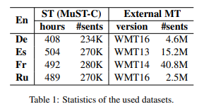

# Extra MT Data Preprocessing
We leverage the same extra mt data in [Ye et al.](https://arxiv.org/abs/2205.02444). The data sources are listed in the table below.


First, you need download the mt data. Then you should set `DATA_ROOT` to the root of extra-mt data and set `SAVE_ROOT` to the root where you want to store the mmap type data.
And, we recommend setting the `REPO_ROOT` variable to avoid potential path errors.

When the above variables have been set, you can run the following command to automatically preprocess the MUST-C data.
```bash
bash prep_extra_mt.sh [TGT]
```
Where `[TGT]` is the target language (e.g. de).